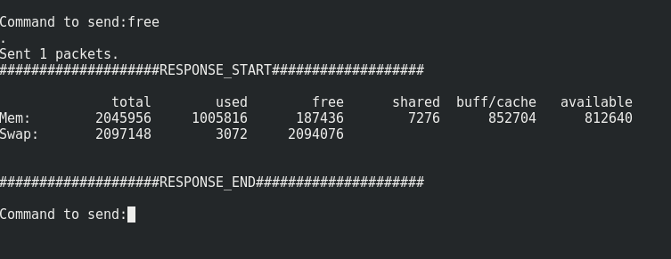

# BCIT COMP8505 Assignment 3 - Backdoor


## Objective 

To become familiar with packet-sniffing backdoors and to implement Linux
backdoor using libpcap library.

## Design


### Diagram


### Pseudo Code

#### Client
```
Main loop

Prompt for command as string

Encrypt command\_string

CREATEPACKET UDP with src/dst IP and port as defined in args.

Insert encrypted command string as packet payload

SENDPACKET to specified destination/port

Sniff for response packet filtering by UDP and srt/dst port as defined.

If sniffed packet

Decrypt packet payload

Print packet payload

END Main loop
```
#### Server
```
Set processname to hide backoor.

Sniff for command packet filtering by UDP and specific src/dst ports.

If sniffed packet

Extract and decrypt payload

Run payload as shell command. Capture stdout and stderr as string.

Encrypt command output.

CREATEPACKET UDP with defined src/dst IP/port. Insert encrypted command
output.

Send packet.
```
## Implementation

The project was implemented in Python using the Scapy, pycrypto and
setproctitle libraries. The client and server were written in separate
.py files. The client.py file takes the, IP and PORT of the target
server as and its self (this allows for the server out put to directed
to an alterative IP than the current clients if needed). The user is
then prompted for a shell command to run on the target server. A UDP
packed is crafted with the defined IP’s and PORTS and sent to the target
server. The target server sniffs for UDP packets based on a defined
combination of src and dst ports. By using scapy/libpcap this packet
sniffing happens before any firewalls. When a matching packet is
sniffed, the payload of the packet is extracted and the shell command
decrypted and run. The output of the shell command is captured,
encrypted and sent back to the IP specified in the command packet.

## Program Instructions

This project was written and tested on Fedora 26 64bit X86 workstations.
Using Python 2.7.13, Scapy 2.3.3, pycrypto 2.6.1 and setproctitle
1.1.10. Please ensure these requirements are met before attempting to
run.

Extract the submitted zip file on the respective host machines and
navigate to the “App” folder. on the command line. Launch the python
scripts with the commands given below. Start the server script first
then the client script. Ensure you run as root. The crypto.py file must
also be present in the working directory as it holds the shared crypto
functions

“python server.py -sp SERVER\_PORT -cp CLIENT\_PORT”

“python client.py -sip SERVER\_IP -sp SERVER\_PORT -cip CLIENT\_IP -cp
CLIENT\_PORT”

For example:

Server IP = 192.168.0.2

Client IP = 192.168.0.1

Server Port = 8082

Client Port = 8081

“python server.py -sp 8082 -cp 8081”

“python client.py -sip 192.168.0.2 -sp 8082 -cip 8081 -cp 8081”

Client IP note: The Client IP can be set to a different IP than the
client issuing the command should you wish the server’s out put be
directed elsewhere.

Encryption note: Encryption is AES the strength of which is defined by
the key length. The shared key and IV are specified in the crypto.py
source. Future iterations should obfuscate the shared key or use
private/public key encryption.

## Tests & Screen shots

Starting the server:


Starting the client:


“ls” from the client:


“free” from the client:



“mkdir” from the client and verifying with “ls”:


Server in debug mode, showing that its output is encrypted:


